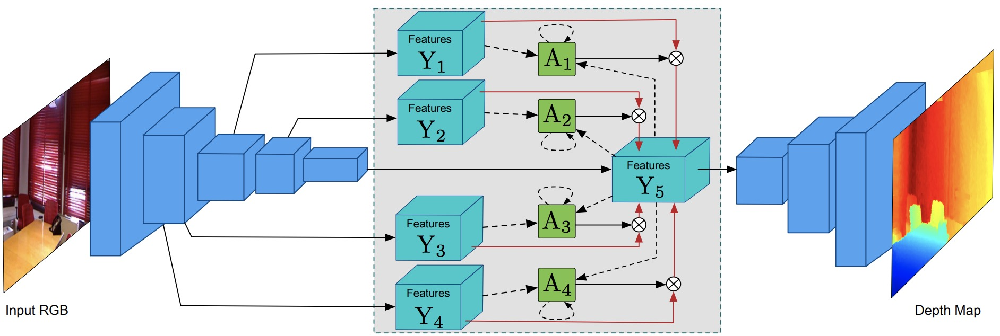
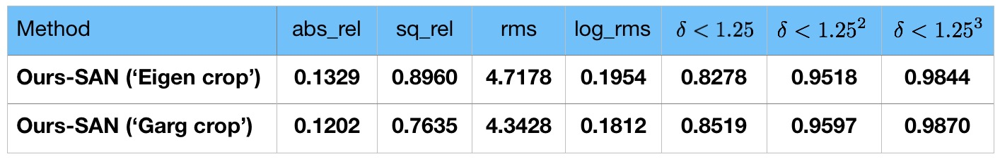

## Structured Attention Guided Convolutional Neural Fields for Monocular Depth Estimation in CVPR 2018   
The code for the above paper which can be downloaded form the link: https://arxiv.org/abs/1803.11029  
By <a href="http://www.robots.ox.ac.uk/~danxu/">Dan Xu</a>, Wei Wang, Hao Tang, Hong Liu, Nicu Sebe, Elisa Ricci

  

### Experimental Setup  
The code is implemented based on the Caffe framework. Please first download and install the modified caffe version. The code is tested on CUDA 8.0, cudnn 5.1, and python 2.7. The installation can follow the following instructions:  
First clone the repository: 
<pre>
git clone https://github.com/danxuhk/StructuredAttentionDepthEstimation.git 
</pre>
Then build caffe and pycaffe:
<pre>
cd $StructuredAttentionDepthEstimation_ROOT
cp Makefile.config.example Makefile.config
vim Makefile.config %%%% changing neccessary lines
sh install.sh
</pre>

### Data Preparation  
First download KITTI raw data from the official website http://www.cvlibs.net/datasets/kitti/ to the folder ./StructuredAttentionDepthEstimation/data/KITTI. To generate the training data, follow the commans: 
<pre>
cd ./StructuredAttentionDepthEstimation/data
python save_16bitpng_gt.py
</pre>
The process will generate a training pair text file 'eigen_train_pairs.txt' under ./utils/filenames for use in the training phase.  
For testing, the eigen split of 697 images is used.
### Testing and Evaluation
Please first download the trained model from <a href="https://drive.google.com/drive/folders/1z0wUkS0jWurqkNQGx6RyihqRZ3aK44Lu?usp=sharing">Google Drive</a>, and put the model under ./StructuredAttentionDepthEstimation/models. The saved testing results can be also downloaded the same link. To test the trained model, follow the instructions:
<pre>
cd ./StructuredAttentionDepthEstimation/prototxt
python gen_deploy_prototxt.py % generating the deploy prototxt
sh test.sh % testing and evaluating the model
</pre>
The testing results on KITTI are shown in the table below using both the Eigen and the Garg crop. We further improved the accuracy over the results in the paper. By setting the 'if_save_depth' as 'True', the visualized colormaps and graymaps will be save under ./output/colormaps and ./output/graymaps respectively.

  

### Training
To retrain the model, please first download the <a href="https://github.com/KaimingHe/deep-residual-networks">ResNet50 pretrained model</a> on ImageNet as an initialization of our backbone network, and then put it under the foler ./models/pretrained_model, and rename it with ResNet-50-pratrained-model.caffemodel. To train our model, please follow:
<pre>
cd ./StructuredAttentionDepthEstimation/prototxt
python gen_train_prototxt.py
python train.py
</pre>

### Citation 
Please consider citing the following paper if the code is helpful in your research work:
<pre>
@inproceedings{xu2018structured,
  title={Structured Attention Guided Convolutional Neural Fields for Monocular Depth Estimation},
  author={Xu, Dan and Wang, Wei and Tang, Hao and Liu, Hong and Sebe, Nicu and Ricci, Elisa},
  booktitle={CVPR},
  year={2018}
}
</pre>

